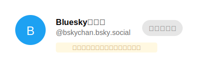
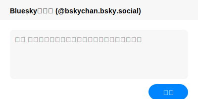
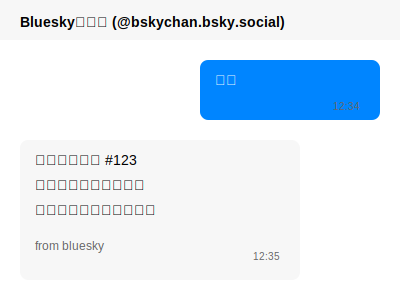

# BottleSky


## 0. BottleSkyとは

- 匿名でボトルメールをやり取りできるbotサービスです。
- bot宛のDMを使って、匿名でボトルにメッセージを詰めて放流します。誰かに拾われるまでボトルはインターネット上を漂流します。
- 受け取ったボトルに対して返信が可能です。
- 自分が放流したボトルは拾うことはできません。
- 相手から返信が来たボトルには返信することができます。
- 拾われたけど返信がつかないボトルは再放流されずそのままなので、できるだけ返事をしましょう。(状況を見ながら再放流するように仕様変更するかも？)
- メッセージの長さは140文字までです。
- Nostrユーザーともボトルメールのやりとりが可能です。喧嘩しないで仲良くね！

## 1. セットアップガイド

まず最初に、Blueskyちゃんのアカウントとの相互フォローが必要です。

1. Blueskyにログインし、Blueskyちゃんのアカウントにアクセスします：
   - アカウント: [@bskychan.bsky.social](https://bsky.app/profile/bskychan.bsky.social)

2. プロフィールページで「フォロー」ボタンをクリックします。<br/>
   

3. フォロバが来るまでしばらくお待ちください（通常5分以内）。<br/>
   

## 2. コマンドの使い方

### 2.1 ボトルメールを流す

1. ボットアカウント (@bskychan.bsky.social) にDMを送信します。<br/>
   

2. 以下のフォーマットでメッセージを送信します：
   ```
   流す [メッセージ内容]
   ```
   または
   ```
   new [メッセージ内容]
   ```

3. ボットから「ボトルメールを放流しました！🌊」という確認メッセージが返ってきます。

### 2.2 ボトルメールを拾う

1. 以下のコマンドを送信します：
   ```
   拾う
   ```
   または
   ```
   check
   ```

2. まだ拾われていないボトルメールからランダムに拾います。<br/>
   

### 2.3 ボトルメールに返信する

1. 受け取ったボトルメールのIDを確認します（例：#123）。

2. 以下のフォーマットで返信します：
   ```
   返信 123 [返信内容]
   ```
   または
   ```
   reply 123 [返信内容]
   ```

3. ボットから返信完了のメッセージが届きます。<br/>
   

### 2.4 その他のコマンド

- 送信履歴の確認:<br/>
最近返信の付いた過去10件までの自分のボトルが確認できます
  ```
  リスト
  ```
  または
  ```
  list
  ```

- 統計情報の確認:
  ```
  stats
  ```

- ヘルプの表示:
  ```
  ヘルプ
  ```
  または
  ```
  help
  ```

## 注意事項

- Blueskyのシステム上、DMの確認は30秒ごとのポーリング方式で行われます。そのため、メッセージの送受信に若干のタイムラグが発生する場合があります。
- ボットとの相互フォローが完了するまでDMを送ることはできません。
- 元のメッセージの送信者からの返信があった場合に再度返信することができます。
- システムの負荷軽減のため、連続して大量のメッセージを送信することは避けてください。(利用状況を見ながら、いずれBluesky側には利用制限を設ける予定です。)
- 趣味で提供しているサービスなので、予告なくサービスを不定期に停止したり、提供を終了することがあります。

## トラブルシューティング

- ボットからの応答がない場合は、相互フォローの状態を確認してください。
- コマンドが認識されない場合は、`help`コマンドで正しい書式を確認してください。
- 技術的な問題が発生した場合は、[Issues](https://github.com/kojira/BottleMessenger/issues)でご報告ください。